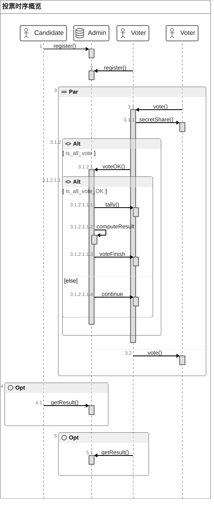

# MPC-Vote 方案

## 概述

本项目展示了一种基于多精度整数的秘密分享实现的安全多方计算（MPC），并将此方法应用在评审打分的具体场景下。

### 使用指南

> 需要进入 evaluation 分支。

开箱即用，启动 admin 模块 + 3 个 voter 模块，在 shell 中输入 help 查看可以使用的命令。由于只为展示算法使用，该项目没有实现候选人注册逻辑，候选人（参赛项目）信息、投票人（专家）信息等已经在 AdminController 中直接定义。

典型的投票流程：

1. 开启一个 admin 模块和 3 个 voter 模块；
2. voter 模块输入 lc 查看候选人信息，r 注册到 admin；
3. 所有 voter 都注册后，打分开始，输入 s 可以查看状态；
4. 输入 v，进入打分状态；
5. 投票完毕后，需要等待其它专家完成打分操作；
6. 打分结束，输入 res 查看打分结果；
7. admin 模块输入 reset 重置状态，进入下一次打分。

> 输入 help 可以查看更多命令信息。

### 时序

以下是项目的主要功能的时序，包括候选人注册（未实现），投票人注册，投票，计票功能。




## 核心算法

### 核心算法

核心代码详见：`cn.edu.hitsz.api.util.MPCUtils`

#### 秘密构建 generateSecret

根据投票信息和投票人的数量构建秘密，如无特别声明，该算法的秘密指的是一个多精度的大整数，投票信息指的是投票者对候选人的投票分值。

例如：

- 输入：
  - voteList = [99, 80, 61]
  - m = 5
- 输出：
  - secret = 25993277
  - （二进制）001100011 001010000 000111101

```java
    /**
     * 根据投票信息和投票人的数量生成大整数秘密
     *
     * @param voteList 对各个候选人的投票信息
     * @param m        参与投票的人数
     * @return 秘密大整数
     */
    public static BigInteger generateSecret(int[] voteList, int m) {

        // 计算比特长度，该长度的作用是避免后续的算法中长度溢出
        int k = (int) (Math.log(m * MAX_SCORE) / Math.log(2)) + 1;

        // 将投票信息转换为大整数
        BigInteger result = BigInteger.ZERO;
        for (int vote : voteList) {
            result = result.shiftLeft(k).add(BigInteger.valueOf(vote));
        }

        return result;
    }
```


#### 秘密恢复 recoverSecret

秘密构建的逆操作，根据提供的候选人（参选者）和投票人（评审专家）信息恢复分发的秘密。

例如：

- 输入：
  - secret = 25993277
  - m = 5
  - n = 3
- 输出：
  - voteList = [99, 80, 61]

```java
    /**
     * 分割大整数，用于将分发出去的秘密恢复，是 generateSecret() 的逆操作
     *
     * @param result 投票的结果
     * @param n      n个候选人
     * @param m      m个投票人
     * @return 每个候选人的票数
     */
    public static int[] recoverSecret(BigInteger result,
                                      int n,
                                      int m) {
        // 将BigInteger转换为字符串
        String numString = result.toString(2);

        // 计算每份的位数
        int partLength = (int) (Math.log(m * MAX_SCORE) / Math.log(2)) + 1;

        // 创建存储结果的int数组
        int[] ret = new int[n];

        // 将每份的数字存储到数组中
        for (int i = 0; i < n; i++) {
            // 提取每份的起始和结束索引
            int endIndex = numString.length() - i * partLength;
            int startIndex = Math.max(endIndex - partLength, 0);

            // 截取每份的字符串并转换为int类型
            String partString = numString.substring(startIndex, endIndex);
            int partNum = Integer.parseInt(partString, 2);

            // 将每份的数字存储到数组中
            ret[n - 1 - i] = partNum;
        }

        // 返回结果数组
        return ret;
    }
```


#### 秘密分享 secretShare

算法的关键，下面将重点阐述该部分内容：

二维数组 scores 表示评审专家（投票者）对所有候选人的打分情况，`scores[i][j]` 表示该专家对第 j 个候选人的第 i 个评分维度打分的结果。

randomSplit() 的作用是将输入的多精度整数分解为 m 份，这 m 份的份额是随机的，但是保证它们的和恰好为这个多精度整数。

secretShare 的主要步骤是：

1. 通过 generateSecret() 将传入的**每一行**（专家对所有候选人的某一个评分维度打分的结果向量）构建一个大整数 secret；
2. 通过 randomSplit() 将构建的大整数 secret 分割成 m 个（即专家数量）随机的子秘密，保证它们之和为 secret；
3. 通过网络，将子秘密分发给每一个评审专家（包括自己）。

```java
    /**
     * 秘密分享
     *
     * @param targets 目标地址
     * @param scores  投票信息，第一维度是项目，第二维度是候选人
     * @param addr    本机地址
     */
    public static void secretShare(List<String> targets,
                                   int[][] scores,
                                   String addr) throws UnsupportedEncodingException {


        // 将秘密随机分割，保证所有的子秘密的和为创建的 secret
        BigInteger[][] result = new BigInteger[scores.length][];
        for (int i = 0; i < scores.length; i++) {
            int[] score = scores[i];
            BigInteger[] subSecrets = randomSplit(generateSecret(score, targets.size()), targets.size());
            result[i] = subSecrets;
        }

        // 将子秘密分发给所有的投票者（含自己）
        for (int j = 0; j < result[0].length; j++) {
            List<BigInteger> toBeSent = new ArrayList<>();
            for (int i = 0; i < result.length; i++) {
                toBeSent.add(result[i][j]);
            }
            System.out.printf("Send [%s] to [%s]...\n", toBeSent, targets.get(j));
            HttpUtils.httpPostRequest(
                    targets.get(j),
                    Map.of("data", toBeSent, "addr", addr)
            );
        }
    }

    /**
     * 将大整数随机分解成 m 份，他们的和为 secret
     */
    private static BigInteger[] randomSplit(BigInteger number, int m) {
        Random random = new SecureRandom();
        BigInteger[] result = new BigInteger[m];
        BigInteger remain = number;
        for (int i = 0; i < m - 1; i++) {
            result[i] = new BigInteger(number.bitLength(), random);
            remain = remain.subtract(result[i]);
        }
        result[m - 1] = remain;

        return result;
    }
```

后续，每个评审专家将收到的共 m 个子秘密向量加和，然后将加和得到的向量 X （x 维向量，长度为评分维度数）发送给管理中心。管理中心通过对收到的共 m 个向量 X 进行加和，得到最终的和向量（x 维），对向量中的每一个数经过秘密恢复 recoverSecret()，得到各个候选人在每个维度的得分。

下面将给出一个示例（2专家、3项目组）演示数据的变化：

1. 投票者的投票矩阵：

   |         | 项目1 | 项目2 | 项目3 |
   | ------- | ----- | ----- | ----- |
   | 创新性a | 32    | 39    | 28    |
   | 技术性b | 39    | 35    | 31    |
   | 实用性c | 16    | 18    | 13    |

2. 经过 generateSecret + randomSplit 后的矩阵：

   |         | 发给专家1 | 发给专家2 |
   | ------- | --------- | --------- |
   | 创新型a | 1075343   | 1031821   |
   | 技术性b | 2111548   | 453347    |
   | 实用性c | 278839    | 774358    |

   11 111100101 011011100

   假如另一专家的矩阵如下：

   |         | 发给专家1 | 发给专家2 |
   | ------- | --------- | --------- |
   | 创新型a | 187043    | 1458809   |
   | 技术性b | 2028171   | 405652    |
   | 实用性c | 1260768   | 447791    |

3. 专家1将会收到两向量：

   | 向量 | 创新型a | 技术性b | 实用性c |
   | ---- | ------- | ------- | ------- |
   | 1    | 1075343 | 2111548 | 278839  |
   | 2    | 187043  | 2028171 | 1260768 |
   | 求和 | 1262386 | 4139719 | 1539607 |

   将求和结果发送给管理中心公开。

4. 管理中心

   |         | 来自专家1 | 来自专家2 | 求和    |
   | ------- | --------- | --------- | ------- |
   | 创新型a | 1262386   | 2490630   | 3753016 |
   | 技术性b | 4139719   | 858999    | 4998718 |
   | 实用性c | 1539607   | 1222149   | 2761756 |

   将求和结果分别经过秘密恢复 recoverSecret()，得到：

   |         | 项目1 | 项目2 | 项目3 |
   | ------- | ----- | ----- | ----- |
   | 创新型a | 57    | 68    | 56    |
   | 技术性b | 76    | 70    | 62    |
   | 实用性c | 42    | 36    | 28    |

